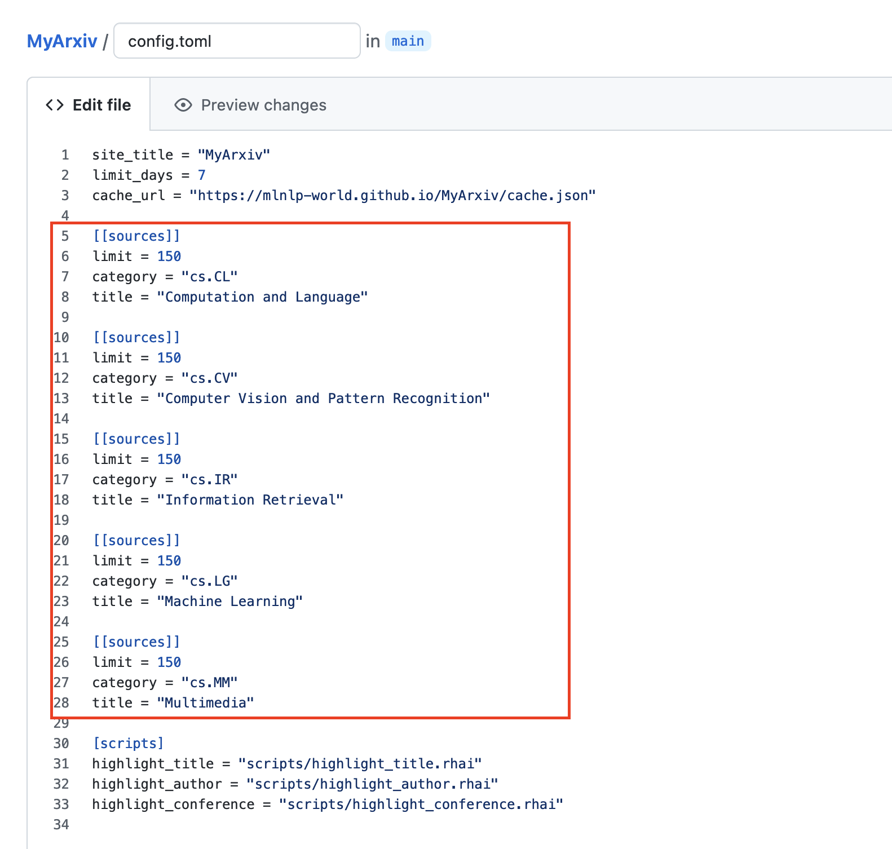
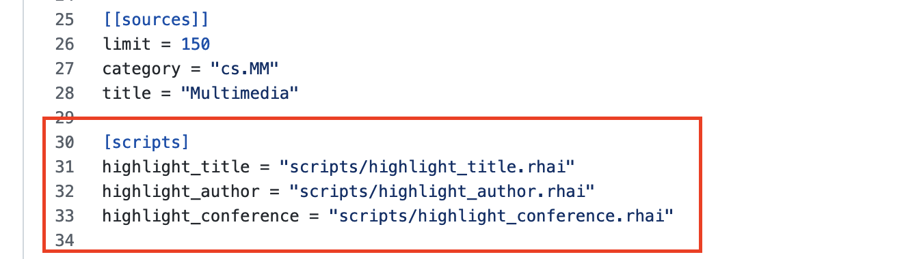
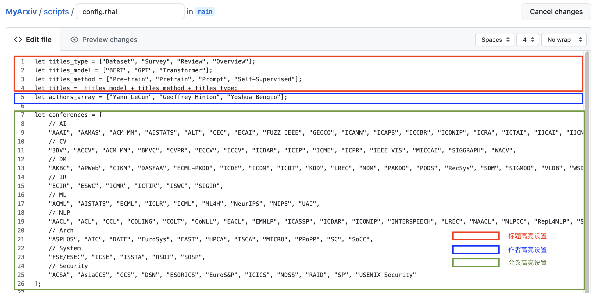

# 3D ArXiv
## 项目简介

`3DArXiv`项目基于[`MyArxiv`](https://github.com/MLNLP-World/MyArxiv)，[`Arxiv官方API`](https://arxiv.org/help/api)与[`Github Actions`](https://docs.github.com/en/actions)相关服务，为大家了提供了`Arxiv`的定制化服务，使用者可以通过配置相关文件，从`Arxiv`每日发布的最新研究成果中，实现个性化地、轻松地阅览属于自己的`Arxiv`网站，其功能如下：

**基本功能**：

- 跟踪3D领域的最新成果
- 缓存指定时段的文章信息

**特色功能**：

- 快速聚焦到文章标题中的指定**关键字**
- 方便注意到文章作者中的指定**学者**
- 及时了解到相关知名**会议、期刊**的学术文章

## 项目预览

使用者可以访问[https://SKDDJ.github.io/3DArXiv/](https://SKDDJ.github.io/3DArXiv/)进行对当前项目进行预览，以便更好地熟悉和使用当前项目。
## 使用说明

- 单击`标题`展开并仔细查看其摘要。
- 单击`摘要`跳转到对应的`Arxiv`文章。
- 指定关键字、指定学者和会议/期刊信息的高亮显示。
- 通过文章条目前缀标识区分论文是新提交的还是更新的`♻`。
- 通过文章条目前缀标识区分论文是否由高亮的作者撰写的`☆` 或`★`。
- 使用`Tab`键展开/折叠所有文章。
- 实现了对于Latex公式的渲染。
- 支持深色/浅色模式。

## 快速上手指南

请fork该项目后进行修改，欢迎提PR优化：

<details open="open">
  <summary>Build Steps</summary>
  <ul>
        <li><a href="#Arxiv-domain"> ➤ 1. Arxiv领域偏好设置 </a></li>
        <li><a href="#highlight-scripts"> ➤ 2. 高亮脚本设置 </a></li>
  </ul>
</details>

<h4 id="Arxiv-domain">1. Arxiv领域偏好设置</h4>

`config.toml`配置文件中，Arxiv领域偏好设置部分如下图所示：



设置的样例如下：

```toml
[[sources]]
limit = 150
category = "cs.CL"
title = "Computation and Language"
```

- `limit`：每天更新当前Arxiv领域中的论文数目，默认为`150`，(*一般来说，大部分单领域Arxiv论文的每日更新数目不会超过150*。)
- `category`：所感兴趣的Arxiv文章领域标识，需根据[Arxiv](https://arxiv.org/)官网查找对应领域的标识。
- `title`：领域标识对应的领域名称，需根据[Arxiv](https://arxiv.org/)官网查找对应领域的名称。

上述设置为一个Arxiv领域对应的设置单元样例，默认设置涵盖NLP研究者主要关注的Arxiv中`cs.CL`、`cs.CV`、`cs.IR`、`cs.LG`以及`cs.MM`领域，使用者可以根据自己的研究偏好参照上述说明进行更改。

<h4 id="highlight-scripts">3. 高亮脚本设置</h4>

`config.toml`配置文件中，高亮脚本设置部分如下图所示：



此部分与高亮信息相关，使用者在此部分可以根据自己的研究偏好，进一步添加定制化高亮信息。

```toml
[scripts]
highlight_title = "scripts/highlight_title.rhai"
highlight_author = "scripts/highlight_author.rhai"
highlight_conference = "scripts/highlight_conference.rhai"
```

目前所支持的高亮信息，包括文章标题、作者和会议名称三个方面。然而此部分所给出的信息只有脚本文件的位置，使用者需要转移到脚本文件夹`./scripts`下修改对应的高亮配置文件`./scripts/config.rhai`，其中文件中相关设置部分如下：



在`./scripts/config.rhai`中，定制化改动如下：

- `let titles = titles_model + titles_method + titles_type;`：标题的高亮可以自定义其内容，默认由***模型***、***方法***以及***类型***三部分组成：
  - `let titles_type = ["Dataset", "Survey"];`：添加需要高亮的文章类型；
  - `let titles_model = ["BERT", "GPT", "Transformer"];`添加需要高亮的文章模型信息；
  - `let titles_method = ["Pre-train", "Pretrain", "Prompt", "Self-Supervised"];`添加需要高亮的文章方法信息；
- `let authors_array = ["Yann LeCun", "Geoffrey Hinton", "Yoshua Bengio"];`添加需要高亮的作者信息；
- `let conferences = [];` 高亮的会议列表，默认包含了当前AI领域的大部分主流会议信息；

## 参考资源
该项目部分参考如下项目：
- [ArxivFeed Template](https://github.com/NotCraft/ArxivDaily)
- Powered By [ArxivFeed](https://github.com/NotCraft/ArxivFeed)

## 致谢
感谢如下项目对本项目提供的帮助：
- [Osmosfeed](https://github.com/osmoscraft/osmosfeed)
- [AlongWY Version](https://github.com/AlongWY/ArxivDaily)
- [LooperXX Osmosfeed Version](https://github.com/LooperXX/ArxivDaily-Old)

